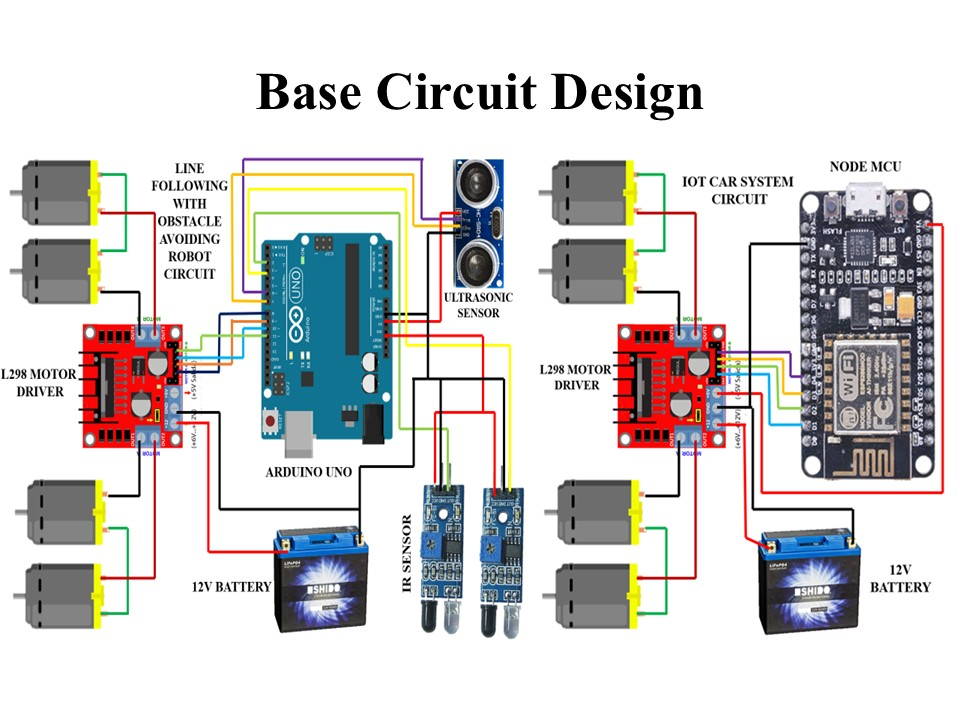
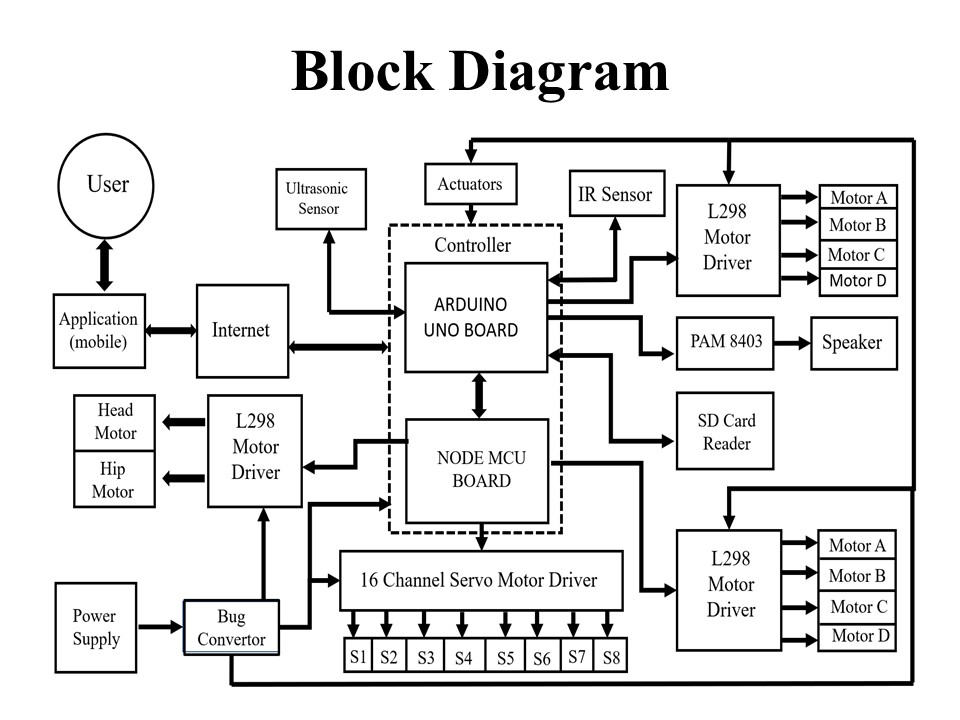

# Voice-Controlled-Humanoid-Robot-
Voice Controlled Humanoid Robot is mainly built to Identify the voice recognizing system in the machines and control the robot using Google assistant through the mobile.

# Project Overview

This project showcases the design and fabrication of a functional humanoid robot developed as part of our final-year Diploma in Mechatronics Engineering at M.L. Bharatesh Polytechnic, Belagavi (India). The primary goal was to create a human-like robot capable of movement, object manipulation, and basic communication, controlled through IoT technology and simple automation features. The project was designed, built, and tested by a team of nine students under the guidance of Mr. Amey Sir and Mr. Suraj Sir, over a development period of eight months.

# Concept & Objective

The aim of this project was to build a semi-autonomous humanoid robot that can:
Assist humans through IoT-based remote operation
Perform pick-and-place tasks with a robotic hand
Interact verbally through a pre-programmed voice system
Move and navigate using line-following and obstacle-avoidance systems
This robot demonstrates how mechanical design, electronics, and IoT control can be integrated to achieve intelligent human-like behavior at low cost.

## ⚙️ Technical Specifications

| **Component** | **Description** |
|----------------|----------------|
| **Microcontrollers** | Arduino UNO and NodeMCU (ESP8266) |
| **Motor Drivers** | L298 Dual H-Bridge |
| **Servo Control** | 16-Channel PWM Servo Controller |
| **Communication** | IoT (Blynk App + IFTTT Integration) |
| **Sensors** | Ultrasonic Sensor (HC-SR04), IR Line-Following Sensors |
| **Actuators** | Servo Motors (for arms, fingers, and head), DC Motors (for base movement) |
| **Power Supply** | 12V DC battery with voltage regulation |
| **Body Design** | Modified mannequin structure with four-wheel-drive mobile base |
| **Programming Tools** | Arduino IDE, Blynk IoT App, IFTTT Webhooks |
| **Connectivity** | Wi-Fi-based IoT control via smartphone app |
| **Voice System** | Pre-recorded responses using voice playback module |
| **Camera Module** | Mounted USB/ESP32-CAM for remote surveillance |

# Features

🧍‍♂️ **Humanoid Motion**

Full 360° head and hip rotation.  
Arm and finger movements powered by servo motors.  
Capable of pick-and-place operations for lightweight objects.

🦾 **IoT Control**

Controlled remotely using a smartphone IoT application (Blynk).  
Wireless communication via NodeMCU (ESP8266).  
User can move the robot base, rotate joints, and operate arms in real time.

🧭 **Autonomous Navigation**

Line-following system using IR sensors.  
Obstacle avoidance with ultrasonic distance sensing.  
Ability to switch modes between IoT control and autonomous driving.

🗣️ **Voice Interaction**

Integrated voice playback system that responds to predefined questions.  
Acts like a basic talk-back assistant for interactive demonstrations.

🎥 **Surveillance Camera**

Mounted camera module for live video streaming.  
Enables remote monitoring of surroundings through the IoT app.

# 🔧 Development Process

**Mechanical Design**

Used a male mannequin as the robot’s physical structure.

Added a four-wheel DC motor base for movement.

Designed arms, fingers, and joints to move through servo actuation.

Fabricated brackets and mounts using metal and acrylic sheets.

**Electronics Integration**

Assembled and soldered all control circuits manually.

Configured Arduino UNO for motion and servo control.

Interfaced NodeMCU (ESP8266) for wireless IoT connectivity.

Integrated IR and ultrasonic sensors for navigation and obstacle detection.

Added a voice module for interactive talk-back responses.

**Software Implementation**

Programmed using Arduino IDE with modular functions for motion, voice, and IoT tasks.

Developed a custom Blynk IoT dashboard for remote control via smartphone.

Calibrated all servos and motors for smooth, synchronized movement.

**Testing & Optimization**

Conducted repeated field tests for motion accuracy and communication stability.

Tuned servo angles for natural human-like movement.

Debugged issues in power distribution, Wi-Fi range, and signal interference.

Verified all operating modes — IoT control and autonomous navigation.

**Challenges Faced**

Limited funding required creative reuse of components and low-cost solutions.

Frequent motor burns, wiring faults, and circuit instability during early tests.

Difficulty maintaining Wi-Fi connectivity for consistent IoT response.

Synchronizing multiple systems (IoT, voice, sensors, and motion) without delays.

Despite these hurdles, continuous teamwork and persistence led to a fully functional humanoid prototype.

# Circuit Diagram 

Base Circuit Design

This circuit controls the robot’s base movement, enabling line following, obstacle avoidance, and IoT-controlled driving.

Main Components

Arduino UNO (Left Section) – Controls line following & obstacle avoidance

NodeMCU (Right Section) – Enables IoT-based control through a mobile app

L298 Motor Drivers (2 Units) – Drive the DC motors on the 4-wheel base

IR Sensors – Detect black and white lines for line following

Ultrasonic Sensor – Detects obstacles and measures distance

12V Batteries (2 Units) – Power supply for Arduino, NodeMCU, and motor drivers

🔹 Connection Breakdown
🧭 Line Following and Obstacle Avoidance (Left Section – Arduino UNO)

IR Sensors → Arduino UNO:

The OUT pins of the two IR sensors connect to the digital pins (e.g., D2, D3) of the Arduino.

Used to sense the track (black/white line).

Ultrasonic Sensor → Arduino UNO:

Trig pin → D9, Echo pin → D10 of Arduino.

Measures distance and prevents collision with objects.

Arduino UNO → L298 Motor Driver (Left):

Digital pins D5, D6, D7, D8 control IN1–IN4 of the L298 driver.

Enables direction and speed control of two DC motors (left side).

L298 Motor Driver → Motors:

Two DC motors are connected at Output1 & Output2 terminals.

Power Supply:

12V battery connected to L298’s Vcc and Arduino’s Vin (via regulated input).

📶 IoT-Based Base Control (Right Section – NodeMCU)

NodeMCU → L298 Motor Driver (Right):

Digital pins D1, D2, D3, D4 connect to IN1–IN4 of the second L298 driver.

Controls the second pair of DC motors (right side).

Power Supply:

Separate 12V battery powers the L298 driver and NodeMCU (through onboard 5V regulator).

⚡ Working Principle

The Arduino handles autonomous functions (line following or obstacle avoidance).

The NodeMCU takes over when IoT mode is enabled, controlling the motors wirelessly via the mobile app.

Only one mode (IoT or Autonomous) is active at a time, selected by a switch or program condition.

**POWER DISTRIBUTION**

12V Battery → Buck Converter

The 12V Battery powers the system.

Red wire (positive) from battery → VIN of Buck Converter.

Black wire (negative) from battery → GND of Buck Converter.

Buck Converter → Servo Motor Driver (PCA9685)

Buck converter steps 12V to 5V output.

5V Output (red) → V+ terminal of PCA9685 servo driver

GND Output (black) → GND terminal of PCA9685

🔹 This 5V is used for all servo motors.

**PCA9685 SERVO DRIVER → SERVO MOTORS**

The PCA9685 has 16 channels (0–15).

Each channel has 3 pins: GND, V+, Signal.

Each servo motor has 3 wires:

Brown/Black → GND

Red → V+ (5V)

Orange/Yellow → Signal

In the diagram:

Servo motors 1–8 are connected to channels 0–7.

Their signal wires are connected to the green pins on PCA9685.

**PCA9685 SERVO DRIVER → Arduino UNO**

The PCA9685 communicates using I²C.

I²C Connections:

PCA9685 SCL → Arduino A5 (blue wire)

PCA9685 SDA → Arduino A4 (green wire)

PCA9685 VCC → Arduino 5V

PCA9685 GND → Arduino GND

Purpose:
Arduino controls all servos via I²C → no need for many PWM pins.

**ARDUINO UNO → NODEMCU**

Communication lines (purple/black wires):

Arduino TX → NodeMCU RX

Arduino RX → NodeMCU TX

Arduino GND → NodeMCU GND

Purpose:
NodeMCU sends commands via WiFi → Arduino executes servo movements.

**SD CARD MODULE → ARDUINO UNO**

The SD module uses SPI communication:

VCC → 5V on Arduino

GND → GND

MISO → Pin 12

MOSI → Pin 11

SCK → Pin 13

CS → Pin 10

Purpose:
Arduino reads audio files from SD card for the voice playback.

**PAM8403 AUDIO AMPLIFIER → SPEAKER**

The PAM8403 has:

5V input

Left/Right audio input

Speaker output

Connections in diagram:

5V from SD card module → 5V input of PAM8403

GND from SD card module → PAM8403 GND

Audio OUT of SD card (or voice module) → IN+ of PAM8403

PAM8403 output L+ / L– → Speaker terminals

Purpose:
Amplifies the audio stored on SD card.

**VOICE RECOGNITION & TALK-BACK MODULE**

Connections shown:

Module GND → Buck converter GND

Module VCC → Buck converter 5V

Signal OUT → NodeMCU digital pin

Audio OUT → PAM8403 input

Purpose:
Detects voice commands and sends trigger signals to NodeMCU/Arduino.

**TOTAL SYSTEM FLOW (Simplified)**

Power Flow:

12V Battery → Buck Converter → 5V

PCA9685, Servo Motors, SD Module, Audio Amp, Voice Module

**Communication Flow**

NodeMCU (WiFi control) ↔ Arduino (Main controller)
Arduino ↔ PCA9685 (servo control)
Arduino ↔ SD Card (audio files)
Voice Module → NodeMCU (voice command trigger)

**Audio Flow**

SD Card → PAM8403 → Speaker

The block diagram represents the complete working architecture of the robot, showing how different hardware components interact to perform movement, sensing, communication, and audio functions. The system begins with the user, who controls the robot through a mobile application. This application sends commands over the internet, which are received by the NodeMCU board via WiFi. The NodeMCU acts as the communication bridge and forwards these received commands to the Arduino UNO, which is the main controller of the entire system.

Inside the controller block, the Arduino UNO and NodeMCU work together. The Arduino takes responsibility for processing incoming commands, controlling motors and servos, reading sensors, and managing the audio system. The NodeMCU ensures wireless communication between the robot and the user through the mobile application.

The power supply provides the necessary voltage to run the system. Since the raw voltage from the battery or power source may be too high for the electronics, it is passed through a buck converter, which steps it down to a stable level suitable for the Arduino UNO, NodeMCU, servo motor driver, sensors, and audio modules. This ensures safe and reliable operation of all components.

For movement, the system uses two types of motor control drivers. On one side, an L298 motor driver is dedicated to operating the head and hip motors. These DC motors require direction and speed control, which the L298 driver provides under the instructions of the Arduino. Another L298 motor driver on the right side controls four additional motors (Motor A, B, C, and D). These motors can be used for actuators, limbs, wheels, or any mechanical movements depending on the robot’s design.

Servo movements are handled by the 16-channel servo motor driver (PCA9685). This board is connected to the Arduino/NodeMCU and can drive multiple servo motors simultaneously with precise angle control. The diagram shows eight servo channels (S1–S8), which may be used for arm joints, hand movements, or other motion-oriented parts of the robot.

Sensing the environment is another important part of the system. The ultrasonic sensor provides distance measurement, allowing the robot to detect obstacles or interact with objects. The IR sensor can detect nearby objects, wall edges, or gestures. Both sensors send their data back to the Arduino, which makes decisions based on this feedback—for example, stopping the robot, changing direction, or responding to user interactions.

The audio subsystem includes an SD card reader, a PAM8403 audio amplifier, and a speaker. Audio files stored on the SD card are accessed by the Arduino, which sends the audio signal to the PAM8403 amplifier. After amplification, the sound is played through the speaker, allowing the robot to talk, play music, or give voice responses.

All modules in the diagram are interconnected to form a seamless working system. Commands from the user travel through the internet to the NodeMCU, then to the Arduino. The Arduino interprets these commands, reads sensor inputs, controls DC motors and servo motors, and handles audio playback. The power system ensures all components are safely powered through the buck converter. Overall, the block diagram illustrates a well-structured control system capable of wireless communication, intelligent sensing, movement control, and audio output.

# 🏆 Achievements

Presented at multiple National-Level Technical Events.

Secured Second Prize at Aavishkar National-Level Technical Fest.

Appreciated by the Department of Mechatronics for innovation and integration.

# 💡 Learning Outcomes

Hands-on experience in IoT integration, robotics motion control, and sensor interfacing.

Strong understanding of embedded system design and human–robot interaction.

Enhanced teamwork, leadership, and problem-solving abilities through real-world prototyping.

# 🧰 Future Improvements

Integrate AI-based speech recognition and computer vision for intelligent interaction.

Upgrade control to Raspberry Pi with ROS for higher autonomy and mapping.

Implement self-charging and path-planning (SLAM) for full autonomous mobility.

Add gesture and voice control with cloud connectivity for remote teleoperation.

# 👥 Team Members

Ajay Mannolkar — Team Leader  
Nilesh Chougule  
Mahadev Jadhav  
Mallikarjun Madapaki  
Kaustubh Melge  
Amrut Marihal  
Bikashmurthy Bhandi  
Praveen Naik  
Vaibhav Shreyakar  

Guides: Mr. Amey Sir and Mr. Suraj Sir

